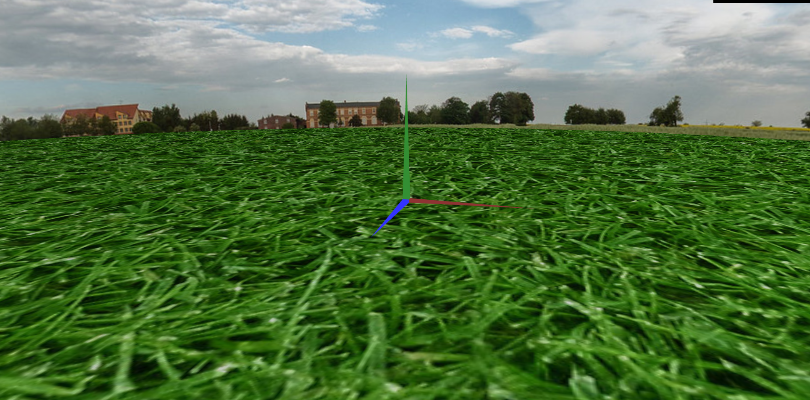
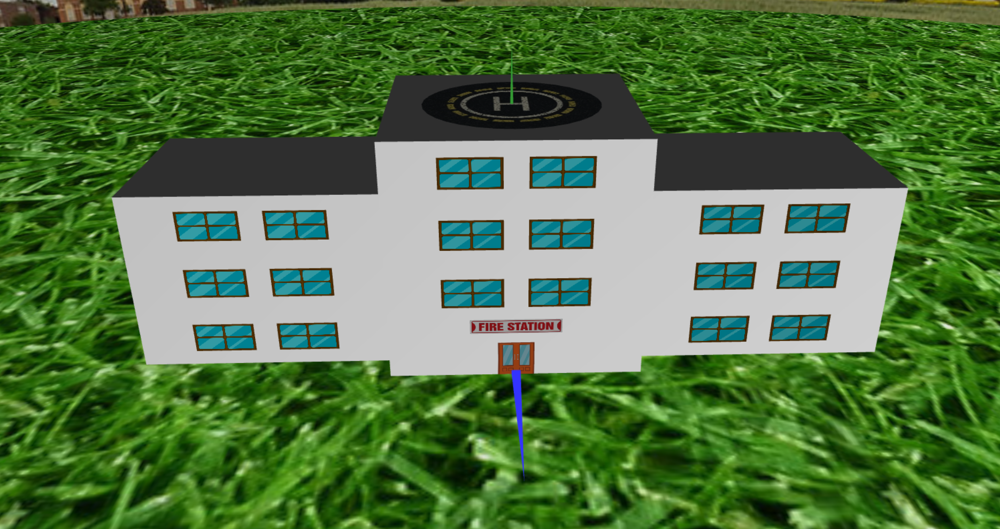
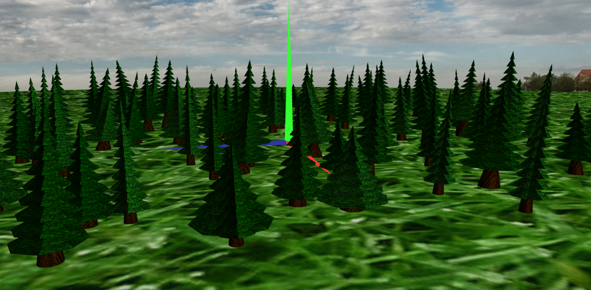
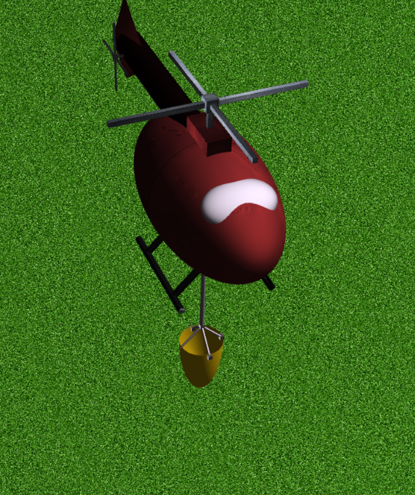
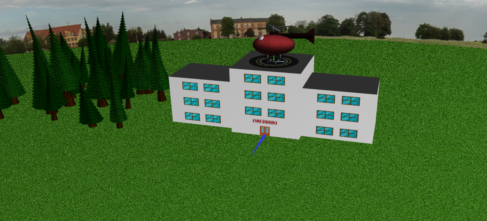
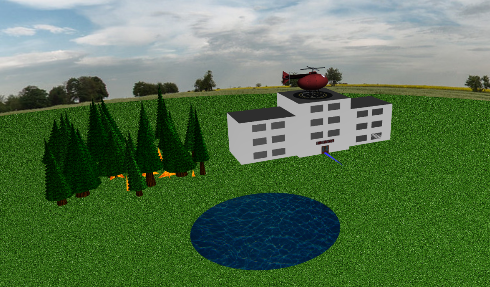
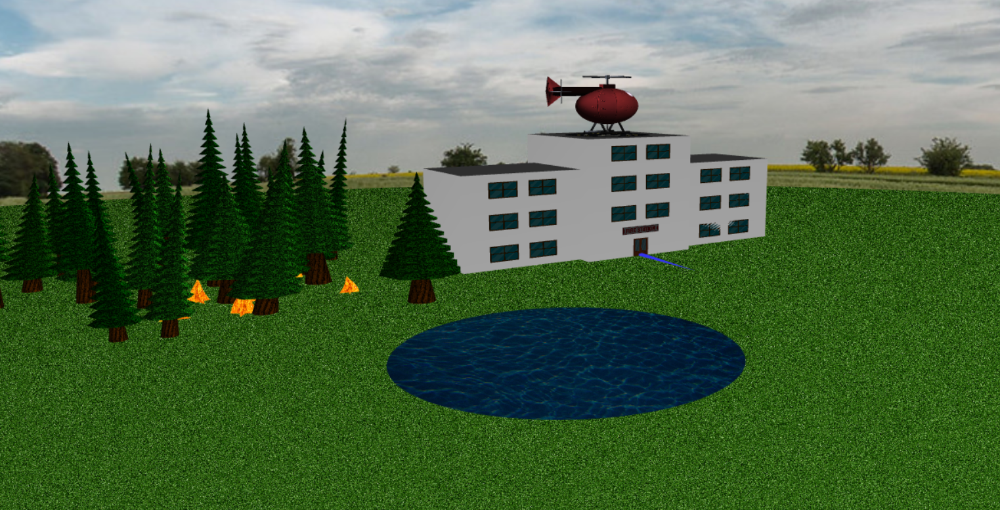
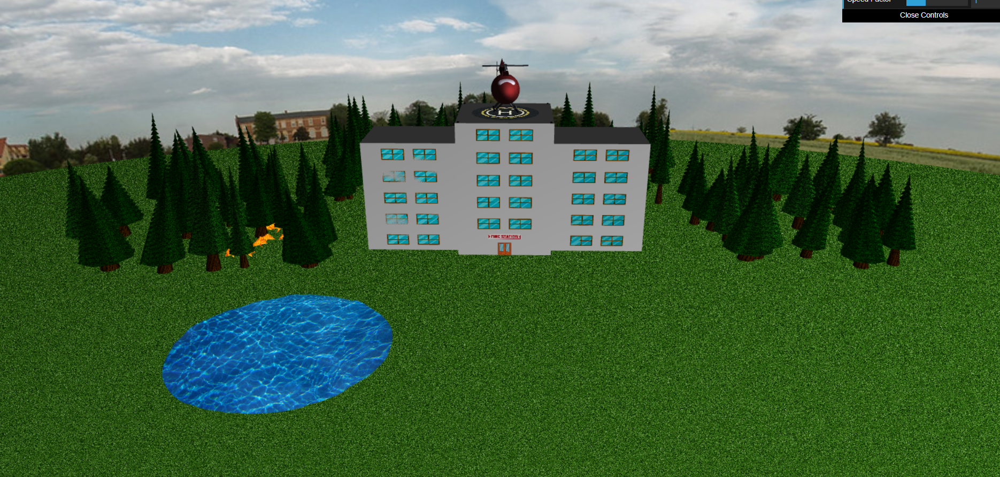

# CG 2024/2025

## Group T12G07

## TP 6 (Project) Notes

- Initially, we faced challenges in modeling the sphere, particularly in achieving its accurate shape and texture mapping. Additionally, the trees presented difficulties, especially in correctly simulating their inclination to maintain a natural appearance. The helicopter was also complex to model due to its numerous distinct components, each requiring precise structuring and integration.

- We did the second aditional development (texture transition in the helipad).

