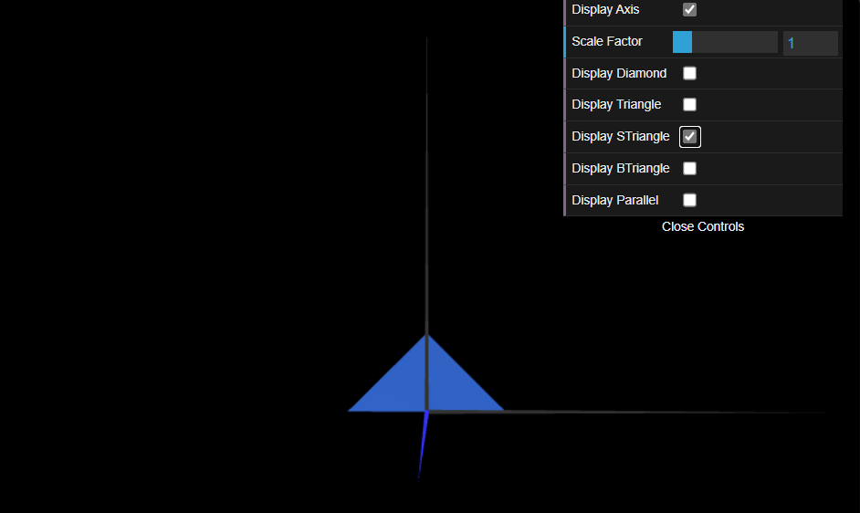
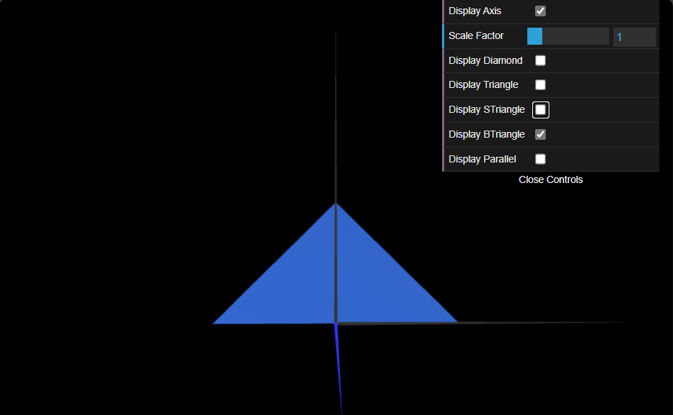

# CG 2024/2025

## Group T12G07

## TP 1 Notes

- In exercise 1 we learned to create objects using the libraries provided. We felt some dificulties initially with the indices and vertices.
- In exercise 2 we didn´t had dificuties because we followed the structure of the objects created in the exercise 1 when implementing the objects of this exercise.

