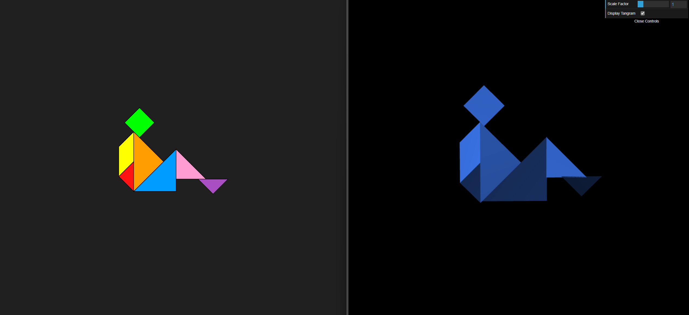
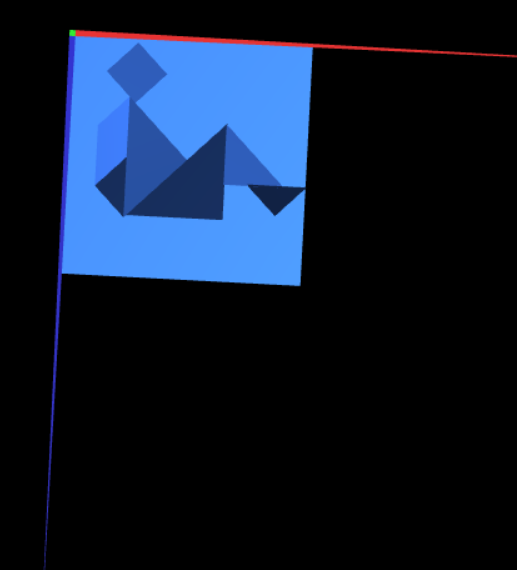

# CG 2024/2025

## Group T12G07

## TP 2 Notes

- We encountered some difficulties when we needed to perform a rotation on an object followed by a translation, especially in the first exercise. The primary challenge was that the axes essentially swap after a rotation, making the subsequent translation more complex to understand.

