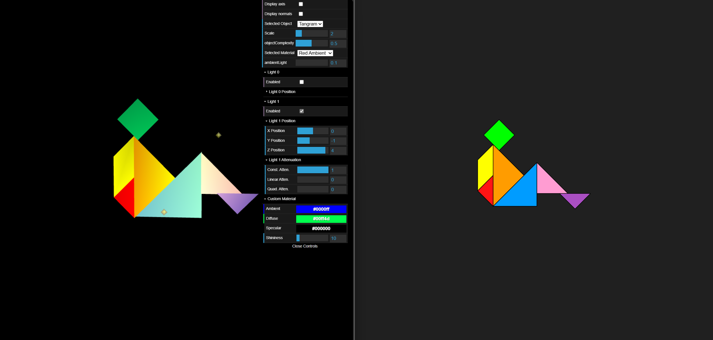
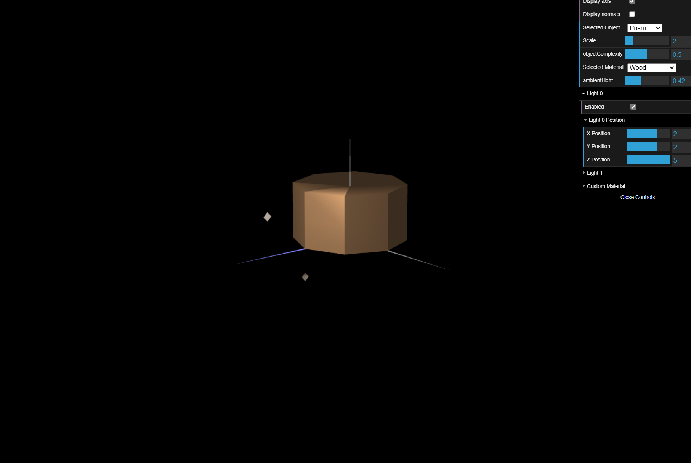
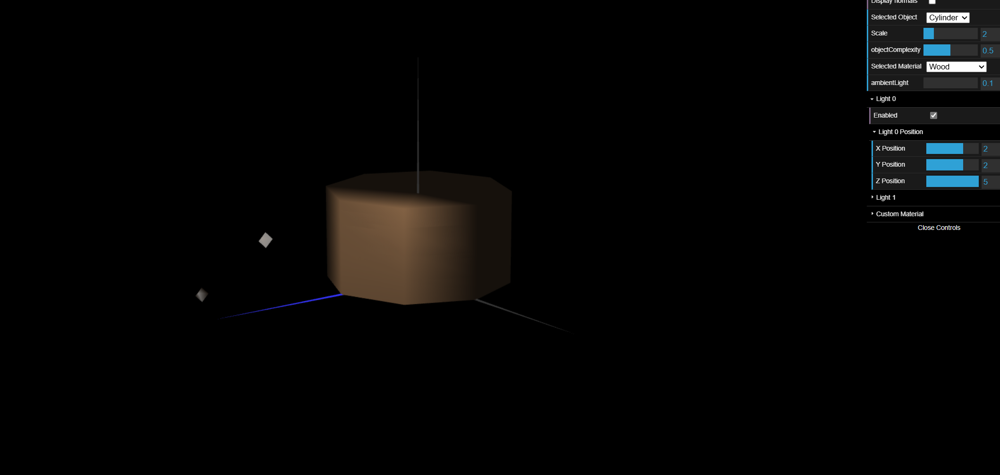

# CG 2024/2025

## Group T12G07

## TP 3 Notes

- We faced challenges while implementing the prism with stacks. Adapting the class from a single-stack solution to accommodate multiple stacks required significant modifications. As a result, the implementation has become somewhat complex and harder to follow.

